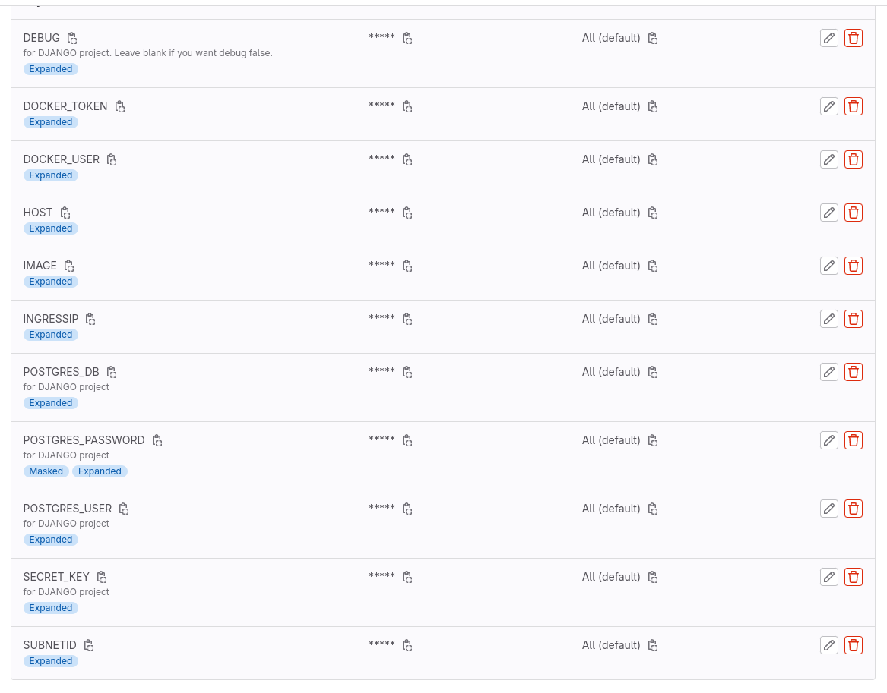
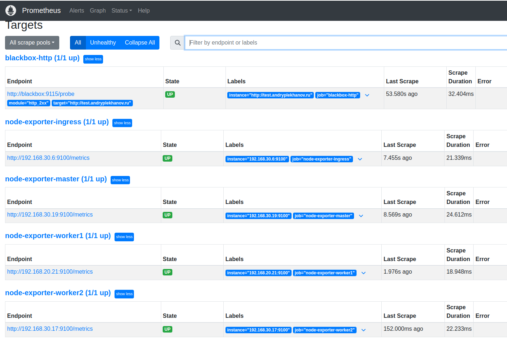
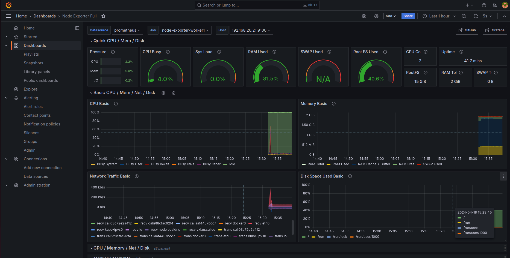
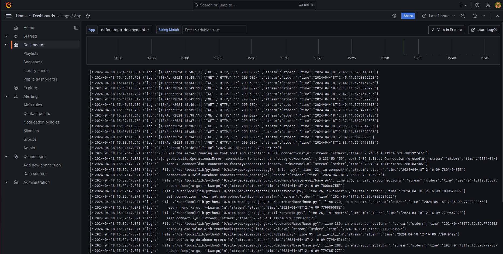

# sf-devops-diploma


**Ссылки на этапы:**

- Спринт 1: https://github.com/andryplekhanov/sf-diploma-sprint1
- Спринт 2: https://gitlab.com/andryplekhanov/dj-project
- Спринт 3: https://gitlab.com/andryplekhanov/monitoring

<hr>

# sprint1

## Задача

```
Опишите инфраструктуру будущего проекта в виде кода с инструкциями по развертке, нужен кластер Kubernetes и служебный сервер (будем называть его srv).

1. Выбираем облачный провайдер и инфраструктуру.
2. Описываем инфраструктуру.
3. Автоматизируем установку.

**Нам нужно:**
- кластер Kubernetes;
- сервер **srv** для инструментов мониторинга, логгирования и сборок контейнеров.

Описывать инфраструктуру мы будем, конечно, в Terraform.

Надо реализовать возможность установки на сервер всех необходимых нам настроек и пакетов, будь то docker-compose, gitlab-runner или наши публичные ключи для доступа по SSH. Положите код автоматизации в Git-репозиторий.
```

## Создание сервера srv (примерно 10 мин.)
1. Вы должны производить действия на локальном хосте с Unix-системой (у меня Ubuntu 2204); должен быть установлен terraform; должны быть сгенерированы ssh-ключи без пароля с именами `id_rsa`и `id_rsa.pub` в директории `~/.ssh/`
2. Скачать репо и перейти в директорию `git clone https://github.com/andryplekhanov/sf-diploma-sprint1.git && cd sf-diploma-sprint1/terraform`
3. Инициировать терраформ `terraform init`
4. Применить `terraform apply -var="yandex_cloud_token=<ваш токен>" -var="cloud_id=<ваш cloud_id>" -var="folder_id=<ваш folder_id>"`
5. В результате получаем в консоли ip-адрес контроллер-сервера **srv**:
```
external_ip_address_srv = [
  [
    "158.160.102.92",
  ],
]
```

## Создание кластера k8s (примерно 15 мин.)
1. Подключиться по ssh к серверу srv `ssh ubuntu@<external_ip_address_srv>`
2. Сделаться суперюзером `sudo su -`
3. Перейти в директорию `cd /opt/kubernetes_setup`
4. Запустить скрипт `sh cluster_install.sh`

Данный скрипт при помощи **Terraform** развернёт в Яндекс-облаке необходимую инфраструктуру для кластера k8s. 
После развёртывания получаем информацию об инфраструктуре.
Нас интересует ip ингресс-контроллера и балансировщика:
```
instance_group_ingresses_public_ips = tolist([
  "158.160.164.226",
])

load_balancer_public_ip = tolist([
  "158.160.165.17",
])
```
**Запомним ip.** Нам они понадобятся на следующем спринте.

5. Через 85 секунд автоматически начнётся развёртка кластера k8s при помощи **Ansible**. 

## Удаление
Если ничего больше не нужно, то удаляем всё в 2 этапа:
1. На сервере **srv**: `sudo su -`, `cd /opt/kubernetes_setup`, `sh cluster_destroy.sh`
2. На локальном хосте в каталоге `sf-diploma-sprint1/terraform`: `terraform destroy -var="yandex_cloud_token=<ваш токен>" -var="cloud_id=<ваш cloud_id>" -var="folder_id=<ваш folder_id>"`

<hr>

# sprint2

## Задача
```
1. Клонируем репозиторий, собираем его на сервере srv.
Это простое приложение на Django с уже написанным Dockerfile.
Приложение работает с PostgreSQL, в самом репозитории уже есть реализация docker-compose — её можно брать за референс при написании Helm-чарта.
Необходимо склонировать репозиторий выше к себе в Git и настроить пайплайн с этапом сборки образа и отправки его в любой docker registry. 
Для пайплайнов рекомендуем GitLab.

2. Описываем приложение в Helm-чарт. Стоит хранить данные в БД с помощью PVC в Kubernetes.

3. Описываем стадию деплоя в Helm.
Настраиваем деплой стадию пайплайна. Применяем Helm-чарт в наш кластер. 
Нужно сделать так, чтобы наше приложение разворачивалось после сборки в Kubernetes и было доступно по бесплатному домену или на IP-адресе с выбранным портом.
Для деплоя должен использоваться свежесобранный образ. 
По возможности нужно реализовать сборку из тегов в Git, где тег репозитория в Git будет равен тегу собираемого образа.
Чтобы создание такого тега запускало пайплайн на сборку образа c таким именем hub.docker.com/skillfactory/testapp:2.0.3.
```

## Решение

### Регистрируем хост
1. Зарегистрировал доменное имя `kirikaru.ru` на timeweb и подключил его к DNS Яндекса `ns1.yandexcloud.net` и `ns2.yandexcloud.net`.
2. На Яндекс-облаке создал публичную зону `kirikaru.ru.` и wildcard A-запись `*.kirikaru.ru.`, указывающую на IP балансировщика (`load_balancer_public_ip`), который мы получили на предыдущем спринте.

<hr>

### Создаём проект на Gitlab и регистрируем раннер на управляющем сервере
1. Создал новый репо на Gitlab, перенёс сюда django-приложение.
2. Добавил новый раннер в проект: `Settings - CI/CD - Runners - New project runner` и получил команду для его регистрации: `gitlab-runner register --url https://gitlab.com --token <токен>`.
3. Зашел на сервер **srv**: `ssh ubuntu@<external_ip_address_srv>`, залогинился под sudo: `sudo su` и применил там вышеуказанную команду. Экзекьютор выбрал **shell**.

<hr>

### Настраиваем свой Dockerhub
1. Идём на Dockerhub. Создаём репо проекта. Записываем себе его название в формате `myusername/myprojectname`.
2. Переходим в раздел `My account / security` и регистрируем новый токен с правами `Read & Write`. Записываем себе username и токен.

<hr>

### Создаём приватные переменные для проекта
1. Идём на Gitlab в наше репо, переходим в раздел `settings/ci_cd/variables`
2. Добавляем все переменные, необходимые для проекта: 
```
POSTGRES_DB: <название базы данных>
POSTGRES_USER: <имя пользователя базы данных>
POSTGRES_PASSWORD: <пароль для базы данных>
SECRET_KEY: <секретный ключ из настроек Django-приложения>
DEBUG: <оставить пустым, если не хотим, чтобы приложение работало в debug-режиме>
IMAGE: <название репо в dockerhub в формате myusername/myprojectname>
DOCKER_USER: <username из dockerhub>
DOCKER_TOKEN: <токен из dockerhub>
HOST: <зарегистрированное доменное имя в формате test.mysite.ru>
INGRESSIP: <ip созданного ингресс-контроллера instance_group_ingresses_public_ips>
SUBNETID: <id подсети, в которой находится ингресс-контроллер>
```
**Результат:**


<hr>

### Пишем helm-chart
Создал директорию `./k8s/helm/`, где создал helm-chart.

Структура чарта:
```
.
├── k8s
│   └── helm
│       ├── values.yaml
│       ├── Chart.yaml
│       ├── templates
│       │   ├── app.yaml
│       │   ├── app-secrets.yaml
│       │   ├── _common.tpl
│       │   ├── postgres.yaml
│       │   └── postgres-secrets.yaml
```
В директории `./k8s/helm/templates` созданы манифесты:
- в `app.yaml`: описаны **deployment**, **service** и **ingress** django-приложения
- в `postgres.yaml`: описаны **deployment**, **service** и **PersistentVolumeClaim** базы данных
- в `app-secrets.yaml`: описаны секреты для **app**
- в `postgres-secrets.yaml`: описаны секреты для **postgres**

В файле `./k8s/helm/values.yaml` собраны всё необходимые настройки для **app** и **postgres**.

<hr>

### Пишем пайплайн для сборки и деплоя

Создал файл `.gitlab-ci.yml` и описал этапы сборки и деплоя.
В пайплайне используются все созданные ранее переменные.

**ВНИМАНИЕ!** Все джобы запускаются только из тегов

**На этапе сборки** происходит логин в наш Dockerhub, сборка образа приложения из Dockerfile (тег подставляется автоматически) и выгрузка готового образа на Dockerhub.

**На этапе деплоя** происходит запуск команды `helm upgrade --install django-release` с автоматической передачей в проект всех необходимых переменных.

<hr>

### В ИТОГЕ
1. В итоге нужно закоммитить и запушить изменения: `git add . && git commit -m 'some six' && git push`
2. Затем проставить и запушить тег: `git tag v1.0.23 && git push origin v1.0.23`. **Только тогда запустится пайплайн.**


**Результат развёртывания приложения в браузере:**


**ВНИМАНИЕ!** Для администрирования Django-приложения через админ-панель необходимо **создать суперпользователя**. Для этого на управляющем сервере **srv** выполняем команды:
- заходим внутрь контейнера: `kubectl exec -it deployment.apps/app-deployment  -- sh`
- создаём суперпользователя: `python manage.py createsuperuser`
- вводим необходимые данные и нажимаем `Ctrl + D` для выхода
- теперь можно войти в админ-панель по адресу `http://<your_site>/admin`

<hr>

# sprint3

## Задача
```
1 Настройка сборки логов.
Представьте, что вы разработчик, и вам нужно оперативно получать информацию с ошибками работы приложения.
Выберите инструмент, с помощью которого такой функционал можно предоставить. Нужно собирать логи работы пода приложения. Хранить это всё можно либо в самом кластере Kubernetes, либо на srv-сервере.

2 Выбор метрик для мониторинга.
Так, теперь творческий этап. Допустим, наше приложение имеет для нас некоторую важность. Мы бы хотели знать, когда пользователь не может на него попасть — время отклика, сертификат, статус код и так далее. Выберите метрики и инструмент, с помощью которого будем отслеживать его состояние.
Также мы хотели бы знать, когда место на srv-сервере подходит к концу.
Важно! Весь мониторинг должен находиться на srv-сервере, чтобы в случае падения кластера мы все равно могли узнать об этом.

3 Настройка дашборда.
Ко всему прочему хотелось бы и наблюдать за метриками в разрезе времени. Для этого мы можем использовать Grafana и Zabbix — что больше понравилось.

4 Алертинг.
А теперь добавим уведомления в ваш любимый мессенджер. Обязательно протестируйте отправку уведомлений. Попробуйте «убить» приложение самостоятельно, и засеките время от инцидента до получения уведомления. Если время адекватное, то можно считать, что вы справились с этим проектом!
```


## Решение

В качестве решения был выбран стэк мониторинга **Prometheus + Loki + Grafana + Alertmanager**.

Разворачивать будем всё при помощи ролей **Ansible**.

<hr>

### Общая логика
1. На все ноды кластера и сервер **srv** устанавливается **node-exporter**, для мониторинга самих хостов.
2. На все ноды кластера устанавливается **promtail** для сбора логов.
3. На сервере **srv** разворачиваются:
   - prometheus, grafana - для сбора метрик и их визуализации;
   - loki для сбора логов от promtail;
   - blackbox - для мониторинга веб страницы с приложением;
   - alertmanager и alertmanager-bot для алертинга.


<hr>

### Описание ролей

**exporters**:
1. На целевых серверах создается директория `/opt/node-exporter`, в неё копируется **dockercompose.yml** файл из директории `files` роли, далее с помощью **docker compose** запускаются сервисы **node-exporter** на хостах.

**monitoring**:
1. На сервере **srv** создаются поддиректории для будущих сервисов в директории `/opt`.
2. На сервер **srv** копируется **docker-compose.yml** файл, который формируется из шаблона **docker-compose-template.j2**. Для формирования файла используются переменные зашифрованного с помошью ansible-vault файла `vars/main.yml`, в нём содержится токен бота и id пользователя.
3. Конфигурация для **node-exporters** формируется динамически, с помощью шаблона **exporters.yml.j2** на основе данных указанных в файле **hosts**.
4. Далее копируются все необходимые файлы конфигураций из директории files, и сервисы запускаются с помощью **docker compose**.

**logging**:
1. На сервере **srv** создаётся директория `/opt/promtail`, в неё копируется `values.yml` файл.
2. **Promtail** разворачивается с помощью готового **helm-чарта** из репозитория https://grafana.github.io/helm-charts в отдельном namespace **logging**.

<hr>

### Запуск ролей

1. Запускать роли необходимо с сервера srv. Клонируем репозиторий: `git clone https://gitlab.com/andryplekhanov/monitoring.git` и переходим в него: `cd monitoring`
2. Редактируем файлы:
   - `hosts`, вбиваем приватные адреса нод кластера и сервера srv.
   - `roles/logging/files/values.yml`, вбиваем приватный адрес сервера srv.
   - `roles/monitoring/files/prometheus.yml`, вбиваем url-адрес своего сайта (строка 19).
3. Редактируем файл **roles/monitoring/vars/main.yml** командой `ansible-vault edit roles/monitoring/vars/main.yml`
Данный файл зашифрован при помощи **ansible-vault**, пароль - `zyHCVr6nWN@n`.
Вбиваем данные: id пользователя и токен Telegram-бота.
4. Выполняем команду `export ANSIBLE_HOST_KEY_CHECKING=False`, чтобы Ansible не запрашивал подтверждение при подключении к серверам.
5. Запускаем поочерёдно три роли:
   - `ansible-playbook -i hosts playbook.yml -t exporters --ask-vault-pass`
   - `ansible-playbook -i hosts playbook.yml -t mon --ask-vault-pass`
   - `ansible-playbook -i hosts playbook.yml -t log --ask-vault-pass`

   При каждом запуске необходимо ввести пароль для декрипта файла с переменными `zyHCVr6nWN@n`


В итоге имеем:
- **Grafana** доступна по публичному адресу сервера **srv** на порту 3000 - http://158.160.102.92:3000/ . Логин и пароль **admin** и **admin**.
- **Prometheus** на том же адресе, на порту 9090 - http://158.160.102.92:9090/

В **Prometheus** на вкладке "**Targets**" должны появиться все таргеты со статусом "UP", а на вкладке "**Alerts**" - правила алертинга.




<hr>

### Настройка Grafana

1. Заходим в интерфейс **Grafana** http://158.160.102.92:3000/ . Логин и пароль **admin** и **admin**.
2. Добавляем **Data source** для **Prometheus**: `http://prometheus:9090/`
3. Добавляем дашборды:
   - импортируем готовый шаблон для **node-exporter** с id - **1860**. В качестве источника указываем **Prometheus**.
   - импортируем готовый шаблон для **loki** с id - **13639**, в качестве источника указываем **loki**.
   - импортируем готовый шаблон для **blackbox** с id - **7587**. В качестве источника указываем **Prometheus**.

В итоге имеем дашборды со всеми метриками, логи и алертинг:






